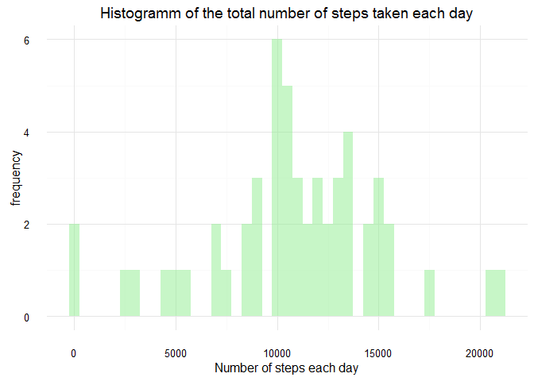
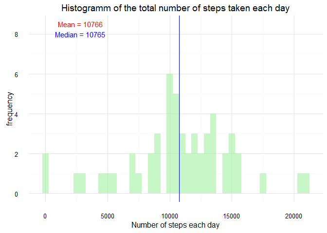
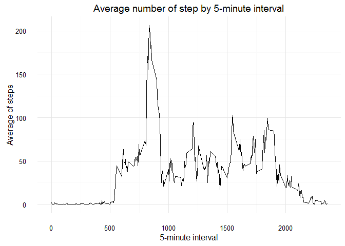
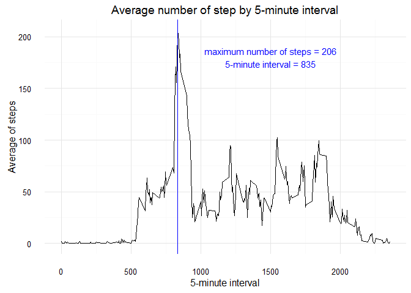
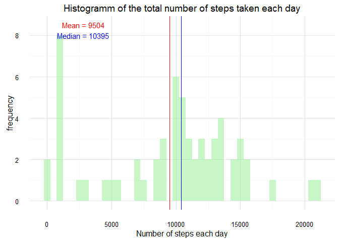
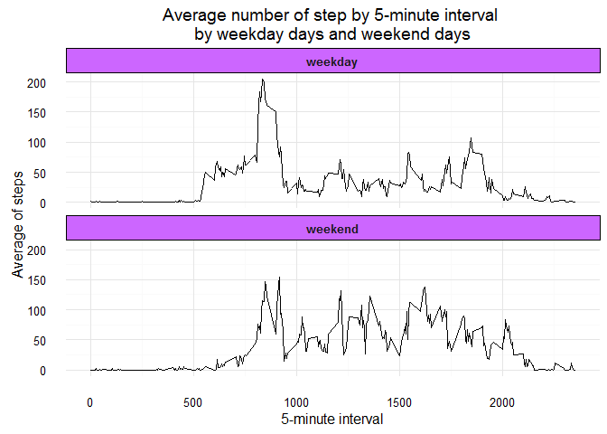

# Reproducible Research: Peer Assessment 1


This assignment makes use of data from a personal activity monitoring device. This device collects data at 5 minute intervals through out the day. The data consists of two months of data from an anonymous individual collected during the months of October and November, 2012 and include the number of steps taken in 5 minute intervals each day.

The data for this assignment can be downloaded from the course web site:

[Dataset: Activity monitoring data](https://d396qusza40orc.cloudfront.net/repdata%2Fdata%2Factivity.zip)

The variables included in this dataset are:

- steps: Number of steps taking in a 5-minute interval (missing values are coded as NA)
- date: The date on which the measurement was taken in YYYY-MM-DD format
- interval: Identifier for the 5-minute interval in which measurement was taken

The dataset is stored in a comma-separated-value (CSV) file and there are a total of 17,568 observations in this dataset.

Before begin the analysis, I create a function that install and call the libraries I could used 


```r
# function to check if a package is installed
pckCheck <- function(x)
{
  if (!require(x,character.only = TRUE))
  {
    install.packages(x,dep=TRUE)
    if(!require(x,character.only = TRUE)) stop("Package not found")
  }
  library(x, character.only = TRUE)
}
```


## Loading and preprocessing the data
First, we're going to unzip the file, load csv file and take a look to ours datas


```r
if (!file.exists("./activity.csv")) {
  unzip("./activity.zip", exdir = ".")
}
datas <- read.csv("activity.csv")
head(datas)
```

```
##   steps       date interval
## 1    NA 2012-10-01        0
## 2    NA 2012-10-01        5
## 3    NA 2012-10-01       10
## 4    NA 2012-10-01       15
## 5    NA 2012-10-01       20
## 6    NA 2012-10-01       25
```

```r
str(datas)
```

```
## 'data.frame':	17568 obs. of  3 variables:
##  $ steps   : int  NA NA NA NA NA NA NA NA NA NA ...
##  $ date    : Factor w/ 61 levels "2012-10-01","2012-10-02",..: 1 1 1 1 1 1 1 1 1 1 ...
##  $ interval: int  0 5 10 15 20 25 30 35 40 45 ...
```


Convert the date's column in date format 


```r
datas$date <- as.Date(datas$date, "%Y-%m-%d") 
class(datas$date)
```

```
## [1] "Date"
```


## What is mean total number of steps taken per day?
For this part of the assignment, you can ignore the missing values in the dataset.


```r
datas.NNA <- na.omit(datas)
head(datas.NNA)
```

```
##     steps       date interval
## 289     0 2012-10-02        0
## 290     0 2012-10-02        5
## 291     0 2012-10-02       10
## 292     0 2012-10-02       15
## 293     0 2012-10-02       20
## 294     0 2012-10-02       25
```


1. Calculate the total number of steps taken per day


```r
agg <- aggregate(steps ~ date, datas.NNA, sum)
head(agg)
```

```
##         date steps
## 1 2012-10-02   126
## 2 2012-10-03 11352
## 3 2012-10-04 12116
## 4 2012-10-05 13294
## 5 2012-10-06 15420
## 6 2012-10-07 11015
```


2. If you do not understand the difference between a histogram and a barplot, research the difference between them. Make a histogram of the total number of steps taken each day

A barplot is used to represent discrete variables, the frequence is represented by the height.
A histogramm is used to reprent continuous variables, the frequence is represented by the area.


```r
pckCheck("ggplot2")
```

```
## Loading required package: ggplot2
```

```r
ggplot(data=agg, 
       aes(agg$steps)) + 
  geom_histogram(fill = "lightgreen", alpha = 0.5, binwidth = 500) +
  theme_minimal() +
  labs(title = "Histogramm of the total number of steps taken each day", y = "frequency", x = "Number of steps each day")
```

<!-- -->


3. Calculate and report the mean and median of the total number of steps taken per day


```r
ggplot(data=agg, 
       aes(agg$steps)) + 
  geom_histogram(fill = "lightgreen", alpha = 0.5, binwidth = 500) +
  geom_vline(data=agg,aes(xintercept=mean(agg$steps)), colour= "red") +
  geom_vline(data=agg,aes(xintercept=median(agg$steps)), colour = "blue") +
  theme_minimal() + 
 annotate("text", x = 2800, y=c(8.5,8), label = c(paste0("Mean = ",round(mean(agg$steps), digits = 0)), paste0("Median = ",median(agg$steps))),colour=c("red","blue")) +
  labs(title = "Histogramm of the total number of steps taken each day", y = "frequency", x = "Number of steps each day")
```

<!-- -->

We can't see the mean line (in red) because it's under the median line (in blue), as we can see on the the graph, these 2 values are really close.


## What is the average daily activity pattern?
1. Make a time series plot (i.e. type = "l") of the 5-minute interval (x-axis) and the average number of steps taken, averaged across all days (y-axis)


```r
agg <- aggregate(steps ~ interval, datas.NNA, FUN = mean)
head(agg)
```

```
##   interval     steps
## 1        0 1.7169811
## 2        5 0.3396226
## 3       10 0.1320755
## 4       15 0.1509434
## 5       20 0.0754717
## 6       25 2.0943396
```

```r
ggplot(agg, aes(interval, steps)) + 
  geom_line() +
  theme_minimal() +
  labs(title = "Average number of step by 5-minute interval", y = "Average of steps", x = "5-minute interval")
```

<!-- -->


2. Which 5-minute interval, on average across all the days in the dataset, contains the maximum number of steps?


```r
max <- agg[agg$steps==max(agg$steps),]
ggplot(agg, aes(interval, steps)) + 
  geom_line() +
  theme_minimal() +
  labs(title = "Average number of step by 5-minute interval", y = "Average of steps", x = "5-minute interval") +
  geom_vline(data=max,aes(xintercept=max[[1]]), colour = "blue") +
  annotate("text", x = 1500, y=180, label = c(paste0("maximum number of steps = ",round(max[[2]], digits = 0) ,"\n5-minute interval = " , max[[1]])), colour="blue")
```

<!-- -->


## Imputing missing values
Note that there are a number of days/intervals where there are missing values (coded as NA). The presence of missing days may introduce bias into some calculations or summaries of the data.


1. Calculate and report the total number of missing values in the dataset (i.e. the total number of rows with NAs)


```r
datas.NA <- datas[!complete.cases(datas),]
NAs <- nrow(datas.NA)
```

There are 2304 rows with missing values.


2. Devise a strategy for filling in all of the missing values in the dataset. The strategy does not need to be sophisticated. For example, you could use the mean/median for that day, or the mean for that 5-minute interval, etc.

For each row in the dataset with missing values, I search the rows with same date or same interval in the dataset without missing values and I calculate the steps's median for these rows and I replace the missing value by this median.


```r
for(i in 1:NAs){
  list <- (datas.NNA[datas.NNA$date==datas.NA[i,2] | datas.NNA$interval==datas.NA[i,3] ,])
  mlist <- median(list$steps)
  datas.NA[i,1] <- mlist
}
head(datas.NA)
```

```
##   steps       date interval
## 1     0 2012-10-01        0
## 2     0 2012-10-01        5
## 3     0 2012-10-01       10
## 4     0 2012-10-01       15
## 5     0 2012-10-01       20
## 6     0 2012-10-01       25
```


3. Create a new dataset that is equal to the original dataset but with the missing data filled in.

I merge the dataset that had missing values, and the dataset without missing values, I check if I have the same number of rows that the original dataset and if there is no missing values.


```r
newDatas <- rbind(datas.NA,datas.NNA)
ndiff <- nrow(datas) - nrow(newDatas)
result <- ifelse(ndiff==0,"is", "is not")
newNAs <- nrow(newDatas[!complete.cases(newDatas),])
```

There is the same number of rows between the original dataset and the new dataset.
Number of rows with missing values in the new Dataset : 0


4. Make a histogram of the total number of steps taken each day and Calculate and report the mean and median total number of steps taken per day. Do these values differ from the estimates from the first part of the assignment? What is the impact of imputing missing data on the estimates of the total daily number of steps?


```r
agg <- aggregate(steps ~ date, newDatas, sum)
ggplot(data=agg, 
       aes(agg$steps)) + 
  geom_histogram(fill = "lightgreen", alpha = 0.5, binwidth = 500) +
  geom_vline(data=agg,aes(xintercept=mean(agg$steps)), colour= "red") +
  geom_vline(data=agg,aes(xintercept=median(agg$steps)), colour = "blue") +
  theme_minimal() + 
 annotate("text", x = 2800, y=c(8.5,8), label = c(paste0("Mean = ",round(mean(agg$steps), digits = 0)), paste0("Median = ",median(agg$steps))),colour=c("red","blue")) +
  labs(title = "Histogramm of the total number of steps taken each day", y = "frequency", x = "Number of steps each day")
```

<!-- -->

Median and mean are both decreased, the mean more than the median, the weaks steps's number are more reprensented on this graph.


## Are there differences in activity patterns between weekdays and weekends?
For this part the weekdays() function may be of some help here. Use the dataset with the filled-in missing values for this part.


1. Create a new factor variable in the dataset with two levels - "weekday" and "weekend" indicating whether a given date is a weekday or weekend day.


```r
Sys.setlocale("LC_TIME", "English") # like that everyone run the code, has the same value weekday in english
```

```
## [1] "English_United States.1252"
```

```r
newDatas$weekday <- weekdays(newDatas$date)
head(newDatas)
```

```
##   steps       date interval weekday
## 1     0 2012-10-01        0  Monday
## 2     0 2012-10-01        5  Monday
## 3     0 2012-10-01       10  Monday
## 4     0 2012-10-01       15  Monday
## 5     0 2012-10-01       20  Monday
## 6     0 2012-10-01       25  Monday
```

```r
newDatas$week <- ifelse(newDatas$weekday %in% c("Saturday", "Sunday"),"weekend", "weekday")
head(newDatas)
```

```
##   steps       date interval weekday    week
## 1     0 2012-10-01        0  Monday weekday
## 2     0 2012-10-01        5  Monday weekday
## 3     0 2012-10-01       10  Monday weekday
## 4     0 2012-10-01       15  Monday weekday
## 5     0 2012-10-01       20  Monday weekday
## 6     0 2012-10-01       25  Monday weekday
```


2. Make a panel plot containing a time series plot (i.e. type = "l") of the 5-minute interval (x-axis) and the average number of steps taken, averaged across all weekday days or weekend days (y-axis). See the README file in the GitHub repository to see an example of what this plot should look like using simulated data.


```r
pckCheck("plyr")
```

```
## Loading required package: plyr
```

```r
agg <- ddply(newDatas, c("interval", "week"), summarise, avg=mean(steps))
head(agg)
```

```
##   interval    week       avg
## 1        0 weekday 2.0222222
## 2        0 weekend 0.0000000
## 3        5 weekday 0.4000000
## 4        5 weekend 0.0000000
## 5       10 weekday 0.1555556
## 6       10 weekend 0.0000000
```

```r
ggplot(agg, aes(y=avg, x=interval)) + 
  geom_line() +
  facet_wrap(~week, nrow = 2 ) +
  theme_minimal() +
  theme( strip.text.x = element_text(size=10, face='bold'), strip.background = element_rect(fill = "#CC66FF")) +
  labs(title = "Average number of step by 5-minute interval \nby weekday days and weekend days", y = "Average of steps", x = "5-minute interval")
```

<!-- -->

```r
 n <- max(agg[agg$week=="weekday",]$avg)
 r <- agg[agg$avg == n,"interval"]
```

During weekday days, there is one peak at 835 5-minute interval, and during weekend days, the number of steps is more staggered between ~ 800 and 2000. 
